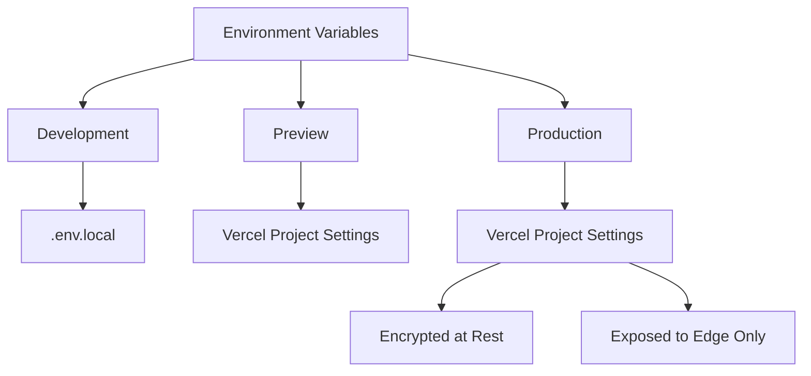
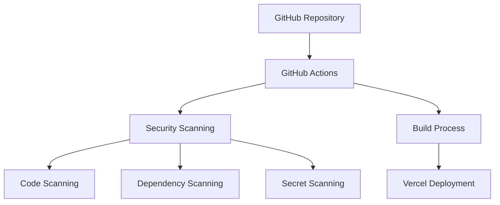
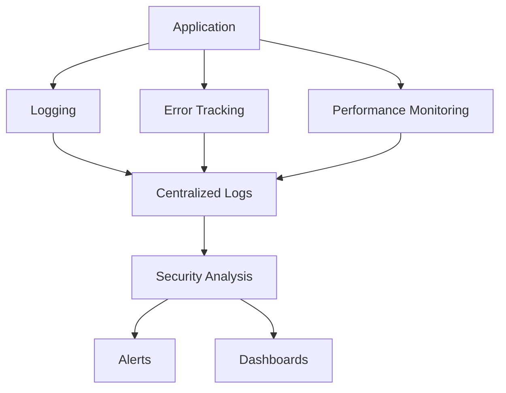

# Deployment and Infrastructure Security Considerations

## Overview

This document outlines security considerations for deploying and maintaining the infrastructure for your Next.js Spotify integration application. Since you're deploying via Vercel, we'll focus on Vercel-specific security best practices while also covering general infrastructure security principles.

## Vercel Deployment Security

### 1. Environment Variables Management

Vercel provides a secure way to manage environment variables. To maximize security:

#### Recommendations:

1. **Environment Separation**:
   - Create separate environment variables for development, preview, and production environments
   - Use environment-specific API keys for Spotify and OpenAI

2. **Secret Rotation**:
   - Implement a regular rotation schedule for API keys
   - Use Vercel's integration with secret management services when possible

3. **Least Privilege**:
   - Create API keys with the minimum required permissions
   - For Spotify API, limit scopes to only what's needed

4. **Access Control**:
   - Restrict access to environment variables in Vercel to team members who need it
   - Enable 2FA for all team members with access to the Vercel project

### 2. Vercel Edge Network Security

Vercel's Edge Network provides several security benefits:

#### Recommendations:

1. **Enable Edge Config**:
   - Store configuration that needs to be accessible at the edge
   - Keep sensitive information out of client-side code

2. **Configure Edge Middleware**:
   - Implement rate limiting at the edge
   - Add IP-based blocking for suspicious activity
   - Validate request origins

3. **Edge Functions Security**:
   - Ensure edge functions don't expose sensitive information
   - Implement proper error handling to prevent information leakage

### 3. Vercel Preview Deployments

Preview deployments can introduce security risks if not properly configured:

#### Recommendations:

1. **Password Protection**:
   - Enable password protection for preview deployments
   - Use environment-specific API keys for preview environments

2. **Branch Protection**:
   - Configure GitHub branch protection rules
   - Require code reviews before merging to production branches

3. **Preview Environment Isolation**:
   - Ensure preview environments can't access production data
   - Use mock data or sandboxed third-party environments for previews

## CI/CD Security

### 1. GitHub Actions Security (if used with Vercel)

#### Recommendations:

1. **Secure GitHub Repository**:
   - Enable branch protection rules
   - Require signed commits
   - Implement required status checks before merging

2. **CI/CD Pipeline Security**:
   - Use GitHub Actions secrets for sensitive information
   - Implement security scanning in the pipeline:
     - Static Application Security Testing (SAST)
     - Software Composition Analysis (SCA)
     - Secret scanning
     - Linting for security issues

3. **Build Process Security**:
   - Use locked dependencies (package-lock.json)
   - Implement integrity checking for dependencies
   - Scan built artifacts before deployment

### 2. Dependency Management

#### Recommendations:

1. **Regular Updates**:
   - Implement automated dependency updates with security scanning
   - Use Dependabot or similar tools to keep dependencies updated

2. **Dependency Scanning**:
   - Regularly scan for vulnerable dependencies
   - Implement automated alerts for critical vulnerabilities

3. **Supply Chain Security**:
   - Use npm audit or yarn audit to check for vulnerabilities
   - Consider implementing npm provenance when available

## Runtime Security Monitoring

### 1. Application Monitoring

#### Recommendations:

1. **Logging Strategy**:
   - Implement structured logging
   - Log security-relevant events:
     - Authentication attempts
     - API key usage
     - Rate limiting triggers
     - Prompt injection attempts
     - Unusual API usage patterns

2. **Error Tracking**:
   - Use a service like Sentry to track errors
   - Configure error handling to prevent sensitive information leakage
   - Set up alerts for unusual error patterns

3. **Performance Monitoring**:
   - Monitor API response times
   - Set up alerts for unusual performance degradation
   - Track resource usage to detect potential DoS situations

### 2. Security Monitoring

#### Recommendations:

1. **API Usage Monitoring**:
   - Track Spotify API usage
   - Monitor OpenAI API usage and costs
   - Set up alerts for unusual patterns

2. **User Behavior Analytics**:
   - Monitor for unusual usage patterns
   - Implement rate limiting based on user behavior
   - Track and alert on potential abuse patterns

3. **Vulnerability Scanning**:
   - Regularly scan your deployed application
   - Implement automated security testing
   - Consider using a Web Application Firewall (WAF)

## Disaster Recovery and Business Continuity

### 1. Backup Strategy

#### Recommendations:

1. **Configuration Backups**:
   - Regularly backup Vercel configuration
   - Store environment variables securely outside of Vercel

2. **Code Repository Backup**:
   - Ensure GitHub repositories are backed up
   - Consider using GitHub Archive Program

3. **Data Backup**:
   - If you add a database in the future, implement regular backups
   - Test restoration procedures regularly

### 2. Incident Response Plan

#### Recommendations:

1. **Define Incident Types**:
   - API key compromise
   - Service outage
   - Data breach
   - Malicious content generation

2. **Response Procedures**:
   - Document step-by-step procedures for each incident type
   - Define roles and responsibilities
   - Establish communication channels

3. **Recovery Procedures**:
   - Document recovery steps for each incident type
   - Test recovery procedures regularly
   - Maintain up-to-date contact information for service providers

## Compliance Considerations

### 1. API Terms of Service Compliance

#### Recommendations:

1. **Spotify API Compliance**:
   - Ensure compliance with Spotify Developer Terms of Service
   - Implement proper attribution
   - Respect rate limits and usage restrictions

2. **OpenAI API Compliance**:
   - Comply with OpenAI's usage policies
   - Implement content filtering
   - Maintain appropriate records of API usage

### 2. Privacy Compliance

#### Recommendations:

1. **Data Minimization**:
   - Collect only necessary data
   - Implement appropriate retention policies
   - Provide transparency about data usage

2. **Privacy Policy**:
   - Create a clear privacy policy
   - Disclose third-party API usage
   - Explain how user inputs are processed

## Infrastructure as Code (IaC)

If you decide to expand beyond Vercel or need additional infrastructure:

### Recommendations:

1. **Infrastructure Definition**:
   - Use Terraform, AWS CDK, or similar tools
   - Version control your infrastructure definitions
   - Implement infrastructure testing

2. **Security as Code**:
   - Define security policies as code
   - Implement automated compliance checking
   - Use IaC security scanning tools

3. **Immutable Infrastructure**:
   - Implement immutable deployment patterns
   - Avoid manual changes to infrastructure
   - Use container-based deployments when possible

## Vercel-Specific Security Hardening

### 1. Team and Access Management

#### Recommendations:

1. **Role-Based Access Control**:
   - Implement least privilege principle
   - Regularly audit team member access
   - Remove access promptly when no longer needed

2. **Multi-Factor Authentication**:
   - Require MFA for all team members
   - Use hardware security keys when possible
   - Regularly audit authentication logs

3. **Single Sign-On**:
   - Consider implementing SSO if you have an existing identity provider
   - Enforce consistent security policies across services

### 2. Domain and DNS Security

#### Recommendations:

1. **Domain Security**:
   - Enable domain lock with your registrar
   - Use a reputable domain registrar with strong security
   - Implement DNSSEC if supported

2. **DNS Configuration**:
   - Regularly audit DNS records
   - Implement CAA records
   - Consider DNS monitoring services

3. **SSL/TLS Configuration**:
   - Use Vercel's automatic SSL
   - Configure strict transport security headers
   - Regularly check SSL/TLS configuration

## Implementation Roadmap

### Phase 1: Immediate Security Improvements

1. **Vercel Environment Configuration**:
   - Audit and secure environment variables
   - Implement proper separation of environments
   - Enable all available security features in Vercel

2. **Monitoring Setup**:
   - Implement basic logging
   - Set up error tracking
   - Configure essential security alerts

### Phase 2: Enhanced Security Measures

1. **CI/CD Security**:
   - Implement security scanning in the pipeline
   - Configure automated dependency updates
   - Set up branch protection rules

2. **Advanced Monitoring**:
   - Implement comprehensive logging strategy
   - Set up dashboards for security monitoring
   - Configure advanced alerting

### Phase 3: Comprehensive Security Program

1. **Incident Response**:
   - Develop incident response procedures
   - Conduct tabletop exercises
   - Document recovery procedures

2. **Regular Security Reviews**:
   - Implement scheduled security assessments
   - Conduct penetration testing
   - Perform regular configuration audits

## Conclusion

By implementing these deployment and infrastructure security recommendations, you'll establish a strong security foundation for your Next.js Spotify integration application. The Vercel platform provides many built-in security features, but it's important to configure them properly and supplement them with additional security measures where needed.

Remember that security is an ongoing process, not a one-time implementation. Regularly review and update your security measures as your application evolves and new threats emerge.